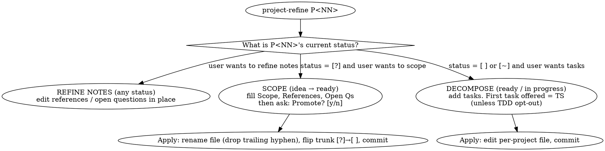

# project-refine

**Core principle:** refinement is a deliberate conversation, not a
form to fill out. Each sub-mode asks one question at a time, lets
the user steer, and never converts an idea to a committed project
without explicit confirmation.

## Iron Law

> **NO PROMOTION WITHOUT EXPLICIT CONFIRMATION.** When all required
> sections (Scope, References, Open questions) are filled, summarize
> what will change and ask `Promote P<NN> to [ ]? [y/n]`. Never flip
> the filename or trunk glyph based on inference alone.
>
> No exceptions: not "the sections look complete", not "the user
> seems done", not "I'll flip and let them undo". Wait for `y`.
>
> Violating the letter of this rule is violating the spirit of it.

## When to use

- *"Let's flesh out P33."* / *"Scope P33."* / *"Promote P33."*
- *"Add tasks to P21."* / *"Decompose P21."*
- *"Refine the references on P19."*
- *"Walk me through P40 — I forgot what we agreed on."*

If the user wants to *create* a new project, that's `project-add`,
not `project-refine`. If they want to *find* a project to work on,
that's `project-next`.

## Sub-modes

The skill enters one of three sub-modes based on the current status
of the named project. **When ambiguous, ask one question.** A `[~]`
project could mean refine-notes (the user wants to reshape the
plan) or decompose (the user wants more tasks). The skill says:

> *"P21 is in progress. Refine notes/references, or add more
> tasks?"*

with multiple-choice options. One turn; no guessing. This matches
the one-question-at-a-time convention from `_conventions.md` §6.

For unambiguous cases — `[?]` ⇒ scope, `[ ]` with no tasks ⇒
decompose, *"refine references on P19"* ⇒ refine-notes — the skill
enters the obvious sub-mode without asking.



### Sub-mode 1: refine notes

Available regardless of status. The skill walks through existing
References and Open questions, asks what's missing or unclear, and
edits in place.

**References-block format check** runs every loop iteration on
non-`[?]` projects: presence, bullet shape, canonical label
order, and resolution of filesystem-style references (per
`skills/project-audit/references/references-block.md`). Cheap;
no filesystem search inside the loop. If the user wants to pull
in plans, specs, or git-derived candidates that have appeared
since the project was last refined, they type `refresh
references` and the helper runs full discovery.

This is also where the **research-dispatch path** lives. The skill
dispatches `project-researcher` subagents **proactively** — when
the user uses any of these verbs in the conversation, dispatch
without asking first:

- *find* (e.g. "find existing rate-limit implementations")
- *look up* / *check the docs* (e.g. "look up the OpenAI rate-limit
  semantics")
- *research* (e.g. "research what the prior art is")
- *investigate* (e.g. "investigate how P19 handles this")

For each independent question, dispatch one `project-researcher`
subagent. Two or more questions ⇒ dispatch in parallel. Each
subagent gets the question pasted inline plus short scene-setting
context — never a path-to-file reference.

When findings come back, summarize for the user and ask where to
fold them: into the *References* block, *Open questions*, or
discard. Apply the user's choice in the same edit.

The aggressive default is intentional: research is the part of
scoping that benefits most from parallel work, and asking
*"should I dispatch a researcher?"* costs a turn the user almost
always answers yes to. If the user does NOT want research and the
verb was incidental ("I already looked this up"), they can say so
and the skill cancels — but starting the dispatch is the default.

See `agents/project-researcher.md` for the prompt shape and
`_conventions.md` §8 for the rules (read-only, inputs inline,
parallelize the read).

### Sub-mode 2: scope (idea → ready)

Available when the project is `[?]`. **Before walking the
checklist**, read the existing idea-state file. If it has
`### Open questions` or `### Notes` sections (captured by
`project-add` at idea-time), the skill carries that content
forward as seeds:

- Show the existing items to the user, e.g.
  *"Day-1 you captured these open questions: [list]. Keep,
  edit, or replace them?"* The default answer is "keep".
- Notes content gets shown the same way and the user is asked
  where to fold it: into Scope context, References, or to keep
  as `### Notes` for now.
- If the user picked `keep`, the existing items pass through
  into the scoped state unchanged. If they picked `edit` or
  `replace`, the helper prompts for the new content one item at
  a time.

The point: idea-time context is volatile and valuable — losing
it at promotion is exactly the friction the four-question
capture flow is designed to prevent. Regeneration with the
existing content as seed input preserves the user's day-1
thinking through the boundary.

After the seed pass, walk the user through the promotion
checklist:

1. **References** — runs the references-block helper FIRST
   (before scope/open questions). The helper searches
   `~/.claude/plans/`, `<repo>/docs/superpowers/plans/`,
   `<repo>/docs/superpowers/specs/`, `<repo>/docs/`,
   `<repo>/specs/`, `<repo>/archive/research/`, and
   `<repo>/projects/`, plus recent `git log` output for URLs and
   ticket IDs, then surfaces candidates and prompts. See
   `skills/project-audit/references/references-block.md` for the
   full procedure and format spec. References are gathered first
   because the references contract starts the moment the project
   leaves idea state — scope/tasks come *after* the prior-art
   inventory exists.
2. **Scope** — What's in scope? What's explicitly out?
3. **Open questions** — What's still unresolved?

Use the **one-question-at-a-time** convention from
`_conventions.md` §6: ask one, wait, *re-evaluate*, then decide
what to ask next. Multiple-choice when there's a reasonable
enumeration.

**Empty-block promotion.** If the helper surfaces no candidates
and the user has nothing to paste, the helper warns:
*"This project will fail audit (`references-block`) until at
least one reference is added. Proceed with empty block? [y/n]"*.
`n` aborts promotion (project stays `[?]`); `y` promotes with an
empty block and a known-failing audit state until references are
added. The failing-audit signal is by design — it makes the
references-owed state visible rather than hidden.

When all three are filled (the user can move on with one or two
"none" or "later" answers, but not zero), produce a promote
summary:

```
P<NN> ready to promote.
  Title: <title>
  Scope: <2–3 line summary>
  References: <count>
  Open questions: <count>
Promote P<NN> to [ ]? This will:
  • rename projects/P<NN>-<rough>-.md → projects/P<NN>-<final-slug>.md
  • flip the trunk row from [?] to [ ]
  • commit both edits in one go
[y/n]
```

On `y`:
- Rename the file (drop the trailing hyphen, finalize the
  kebab-case slug from the title).
- Add `### Scope`, `### Out of scope`, `**References**` (block at
  top of body), `### Open questions`, and an empty `### Tests &
  Tasks` to the file. The `**References**` block's first bullet
  is always
  `- **Trunk:** [PROJECTS.md](../PROJECTS.md)` — the back-pointer
  to the trunk. The remaining bullets come from the
  references-block helper run earlier in the scope checklist.
- Update the trunk row to use the standard markdown-link format:
  `- [ ] **P<NN>** — [<title>](projects/P<NN>-<slug>.md)` (glyph
  `[?]` → `[ ]`, title becomes a markdown link to the renamed
  file). The legacy `→ projects/...` arrow form is drift; the
  audit's `trunk-row-link-format` check flags it.
- `git add` both files.
- `git commit -m "docs(projects): promote P<NN> — <title>"`.

On `n`: leave everything as-is, save current refinements (if any)
to the idea stub, and exit.

### Sub-mode 3: decompose

Available when the project is `[ ]` or `[~]`. The skill helps add
tasks to `### Tests & Tasks`.

**TDD bias** (companion proposal §9): if the project has zero
tasks, the *first* task offered is `P<NN>-TS01` (test stub). The
skill says so explicitly and offers an opt-out:

> *"Per the TDD bias, the first task is `P<NN>-TS01` — a test
> stub. If TDD doesn't apply (this is documentation, ad-hoc
> research, or config-only), say so and I'll add `**TDD: not
> applicable**` to the body and start with `T01` instead."*

**Numbering is automatic.** The skill picks the next available
`T##` or `TS##` (max+1 within the project, separately for the two
kinds) — the user provides the description. This matches
`project-add`'s "always max+1" philosophy and avoids gaps that
would later trip `project-audit`'s `unique-task-ids` and ordering
checks. If the user wants a specific number for an organizational
reason, the skill picks max+1 anyway and notes the picked number
in its confirmation. (Audit will surface gaps if any get
introduced manually later.)

After the first task, the skill asks one task description at a
time, prefixed with the number it has picked
(e.g. *"Next: P21-T03. What's the description?"*). Ask, wait,
re-evaluate, repeat. Stop when the user says they're done.

When the first task lands and the project was `[ ]`, flip the
trunk glyph to `[~]` in the same edit (companion proposal §6.4).

### Sub-mode 4 (implicit): re-scope an in-progress project

If the user wants to re-scope a `[~]` project (e.g. discovered the
scope was wrong mid-flight), the skill enters refine-notes mode.
The Iron Law does not apply (no promotion is happening); but any
task additions/removals are visible in the diff and the user
approves the commit message.

## What it deliberately does not do

- Does not create new projects. That's `project-add`.
- Does not execute tasks. When the user is ready to *do* the work,
  the skill ends with a text pointer:
  *"P21-T03 is ready. Hand to Superpowers
  (`superpowers:executing-plans`) or just start editing."*
- Does not flip task checkboxes during execution. That's whoever
  executes the task, per companion proposal §8.
- Does not block on dependencies. If the user wants to refine P21b
  while P21 is `[~]`, mention the dependency in one line and let
  the user decide.
- Does not auto-promote. Iron Law.
- Does not dispatch researchers blindly. *"Find"*, *"look up"*,
  *"research"*, *"investigate"* — the trigger verbs — must appear
  in the user's actual message. The skill does not invent a
  research need where none was expressed.

## Red Flags

| Thought | Reality |
|---------|---------|
| "Sections look filled, I'll just promote" | No. Iron Law. Ask first. |
| "User wants tasks but no TS yet, I'll add T01" | No. Default first task is TS01 unless they explicitly opt out. |
| "I'll list all the refinement questions in one message" | One question per message. Re-evaluate after each answer per `_conventions.md` §6. |
| "User mentioned a new idea mid-refine, I'll capture it inline" | No. Point at `project-add` and stay focused on the project at hand. |
| "User said 'find', I should ask before dispatching a researcher" | No — dispatch on the trigger verbs (find / look up / research / investigate). The user can cancel if they didn't mean it. Asking first costs a turn most users answer 'yes' to. |
| "I'll dispatch a researcher because *I* think prior-art lookup would help" | No — the trigger verbs must appear in the user's message. The skill doesn't invent research needs. |
| "User wants T03 but the next free is T05; I'll let them have T03" | No. Auto-number max+1. Gaps confuse downstream readers and trip audit. |
| "Promote first, fix the slug afterwards" | No. Promotion atomically renames the file *and* flips the glyph. There is no two-step. |
| "Scope first, references later — they can fill the block in afterwards" | No. References run first in scope mode. The contract starts at promotion. If they have nothing, the empty-block confirmation is the visible record of what's owed. |
| "Re-search the filesystem on every refine-notes turn — fresh data is good" | No. Refine-notes uses the format check only. Full search is opt-in via `refresh references` so the loop stays cheap. |

## Common Rationalizations

| Excuse | Reality |
|--------|---------|
| "The Iron Law is for ambiguous cases, this one's obvious" | The Iron Law survives "obvious". The cost of one extra `[y/n]` is tiny; the cost of an unwanted promotion is the user editing the file by hand to undo it. |
| "Decompose without TS is fine, the user knows TDD" | Then they'll tell you. The default is TS-first; opt-out is an explicit string in the body. |
| "Multiple questions in one message saves turns" | It saves turns and loses information — the user picks the easiest to answer and forgets the rest. One at a time. |
| "Researchers in parallel for an obvious question" | If the question is obvious, the parent has the answer already and can fold it in directly. Researchers are for things you actually need to look up. |

## See also

- `_conventions.md` §6 — one-question-at-a-time, iteratively.
- `_conventions.md` §8 — subagent rules.
- `agents/project-researcher.md` — read-only research subagent
  this skill dispatches in parallel during sub-mode 1.
- `skills/project-audit/references/references-block.md` —
  format spec and discovery helper invoked at scope entry
  (sub-mode 2) and re-verified during refine-notes (sub-mode 1).
- `project-add` — when the user wants to create a new project
  (including mid-refine).
- `project-next` — when the user wants to pick a different
  project to refine.
- `project-audit` — when refinement reveals drift the user wants
  to clean up before continuing.
- Superpowers (`superpowers:writing-plans`) — when scoping
  produces enough detail to warrant a full implementation plan.
- Superpowers (`superpowers:executing-plans`) — when decomposition
  produces tasks ready to execute.
